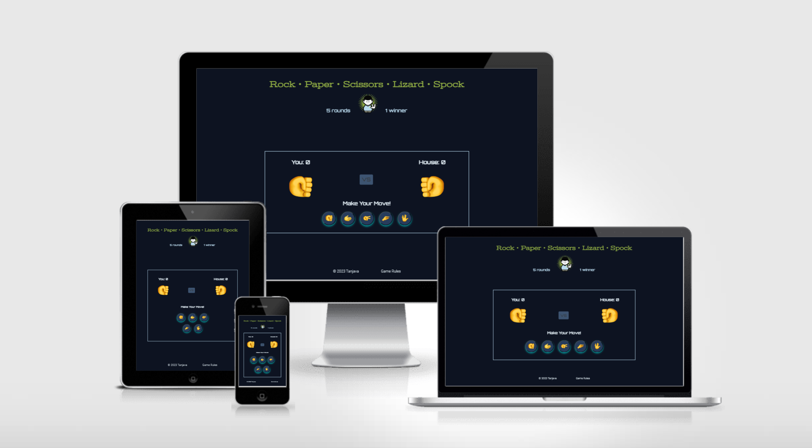
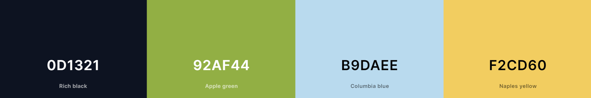
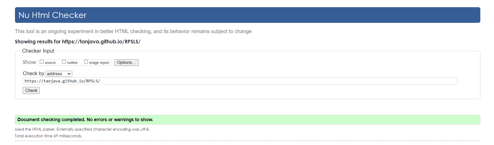
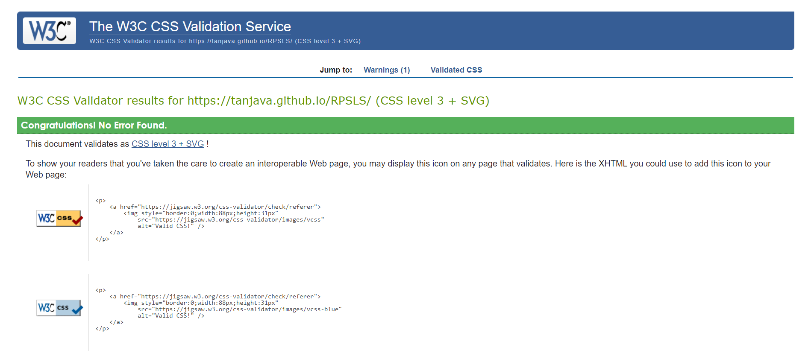
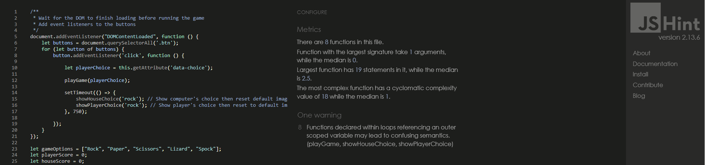
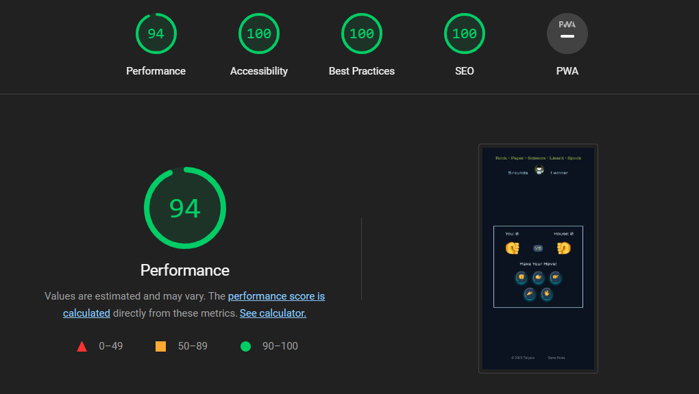

# RPSLS - A game of Rock, Paper, Scissors, Lizard, and Spock

Rock, Paper, Scissors, Lizard, Spock, also known as RPSLS, is a game of chance and is the exended and more complex version of the classic hand game 'Rock, Paper, Scissors'. This 'Lizard Spock' version has been made popular by the television show "Big Bang Theory.

The live game can be accessed and played here - [RPSLS Game](https://tanjava.github.io/RPSLS/)

# Table of contents
- [Design](#design)
  - [Color Scheme](#color-scheme)
  - [Typography](#typography)
  - [Images](#images)    
- [Features](#features)
  - [Existing Features](#existing-features)
    - [Languages Used](#languages-used)
    - [Header](#header)
    - [Gameboard](#wgameboard)
    - [Scoreboard](#scoreboard)
    - [Game Option Buttons](#game-option-buttons)
    - [Tooltip](#tooltip)
    - [Visual Feedback](#visual-feedback)
    - [Game Rules](#game-rules)
    - [Footer](#footer)
  - [Future Features](#future-features)
- [What I Learned](#what-i-learned)
- [Testing](#testing)
  - [Validator Testing](#validator-testing)
  - [Unfixed Bugs](#unfixed-bugs)
  - [Frameworks, Libraries & Programs Used](#frameworks-libraries-and-programs-used)
- [Deployment](#deployment)
- [Credits](#credits)
  - [Media](#media)

# Design

The design of the RPSLS game is simple and intuitive, with clear visuals and interactive elements to enhance the user experience.

## Color Scheme

The color scheme of the game is based on the logo and the yellow hand emojis. The following colors were chosen:

## Typography

The following fonts were used in the game:

- Stint Ultra Expanded: 
  - Used for the game title for a playful feel
- Orbitron
  - Used for the headings of the game elements for a futuristic and geometric vibe
- Roboto
  - Used for other text

## Images

Hand emoji images were used as game gestures.

✊ Raised Fist (rock)
🤚 Raised Back of Hand (paper)
✌️ Victory Hand (scissors)
🤏 Pinching Hand (lizard)
🖖 Vulcan Salute (Spock)

# Features

## Existing Features:

The RPSLS Game is a one-page game website with interactive elements and visual cues. Users can select their hand choice and play against the computer for 5 rounds. The player with the highest score at the end wins the game.

### Languages Used

- HTML5 
    - Used for structuring the content and elements of the game
- CSS3
    - Used for styling the website
- JavaScript
    - Used for implementing the game logic and interactivity

### Header

The header at the top of the page includes the game's title and logo. 

### Gameboard

The gameboard is the main section of the game that displays the user's and computer's scores, their choices (represented by large emoji images), and the game options (buttons).

### Scoreboard

The scoreboard displays the current scores for the user and the computer. The scores update dynamically as the game progresses based on the outcome of each round.

### Game option buttons

There are five game option buttons, each representing a different choice: Rock, Paper, Scissors, Lizard, and Spock. The buttons glow and subtly lift when the user hovers over them, making the game more engaging. Clicking on a button starts a game round. The winner of the round is determined based on the player's choice and the randomly generated computer's choice.

### Tooltip

Hovering over each button displays a brief tooltip providing information about the corresponding game move. This helps users understand the rules of the game and the strengths/weaknesses of each move.

### Visual Feedback

The default hand gesture displayed is 'Rock'. Each round, when the user selects their hand choice, the game visually updates the user's and computer's choices with the corresponding emoji images. After a couple of seconds it switches back to 'Rock', simulating how the game is played in real life before players reveal their next hand.

Furthermore, a message for each game outcome (win, lose, or tie) will be displayed after every round (e.g. "You win this round!") and at the end of the game with the final result (e.g. "Game Over. You Lose!").

### Game Rules

In the footer of the website, users can find the game rules. When clicked, a modal will appear with an image showing how the game is played. This can be helpful for new players who are unfamiliar with the expanded version of the game.

- Rock crushes Lizard and (as it always has) crushes Scissors.
- Paper covers Rock and disproves Spock.
- Scissors cuts Paper and decapitates Lizard.
- Lizard poisons Spock and eats Paper.
- Spock smashes Scissors and vaporizes Rock.

### Footer

The footer contains copyright information on the left, and the game rules on the right.

## Future Features

- Add a 'bounce' animation to the default 'Rock' hand emoji before the player's and computer's hands are shown. The game starts with 'Rock', then there's a countdown - 3(rock), 2(paper), 1(scissors), Shoot. On "Shoot" the choices are revealed.
- Add sound effects for each gesture to enhance gaming experience.

# What I Learned

During the development of the RPSLS game, I encountered a situation where I initially wrote a function called 'increaseScore' to increase the score of the winner, but later realized that I could achieve the same result without needing the function.

In the original code, after determining the winner of a round in the 'PlayGame' function, I called the 'increaseScore' function. Inside the 'IncreaseScore' function, I increased the corresponding score based on the winner.

Upon reviewing my code, I realized that I could simplify it by directly increasing the 'playerScore' or 'houseScore' variables within the 'playGame' function itself.

This taught me the importance of continuously reassessing and refining my code as I develop a project, and considering if the use of a function is necessary or if the same result can be achieved in a simpler and more straightforward way.

# Testing

The website was tested on Google Chrome, Microsoft Edge, Safari, and Android devices to ensure compatibility and responsiveness. 

Google DevTools was used to test different devices and screen resolutions. 

All buttons functioned as expected, as did the game itself.

## Validator Testing

- HTML
  - No errors were returned when passing through the official [W3C Validator](https://validator.w3.org/nu/?doc=https%3A%2F%2Ftanjava.github.io%2FLauraCatharina)

- CSS
  - No errors were found when passing through the official [Jigsaw Validator](https://jigsaw.w3.org/css-validator/validator?uri=https%3A%2F%2Ftanjava.github.io%2FRPSLS%2F&profile=css3svg&usermedium=all&warning=1&vextwarning=&lang=en):

- JavaScript
  - No errors were found when passing through [JSHint](https://jshint.com/):

- Lighthouse (Accessibility Audit)

## Unfixed Bugs

No major bugs were detected, but minor improvements and optimizations can still be made.

## Frameworks, Libraries and Programs Used

- Github: Store Repository
- Gitpod: Create HTML, CSS and JavaScript files
- Google Fonts: 
  - Font-family 'Stint Ultra Expanded', 'Orbitron', and 'Roboto'
- Am I Responsive
  - Screenshot of the final project on different devices

# Deployment

The site was deployed to GitHub pages. The steps to deploy are as follows: 

  1. In the GitHub repository, navigate to the Settings tab. 
  2. From the settings tab, select the 'Pages' tab in the 'Code and Automation' section.
  3. In the source section, select 'Deploy from a branch' and in the branch section, select 'Main' and click 'Save'.
  4. The page will update and show "Your site is live at https://username.github.io/repository-name/", indicating a successful deployment. 

The live link for the site can be found here - https://tanjava.github.io/RPSLS/

# Credits

Some useful sites that really helped me throughout this project: 
- https://devdocs.io/javascript/
- https://stackoverflow.com
- https://www.w3schools.com/

## Media

Images:

- Website Logo
    - [PngAAA-4532035](https://www.pngaaa.com/detail/4532035)
- Emojis 
    - [Emojipedia](https://emojipedia.org/)