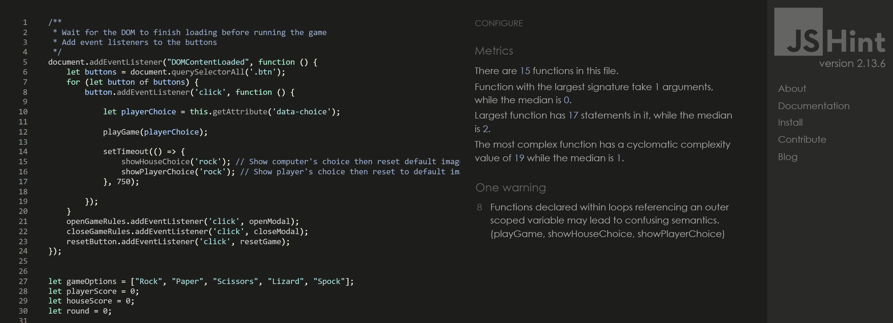

# RPSLS - A game of Rock, Paper, Scissors, Lizard, and Spock

Popularized by the TV Show "The Big Bang Theory", Rock, Paper, Scissors, Lizard, Spock (RPSLS) is a game of chance and the extended version of the classics game of Rock, Paper, Scissors. 

Each player picks a random variable and reveals it at the same time. 

- Scissors cuts Paper
- Paper covers Rock
- Rock crushes Lizard
- Lizard poisons Spock
- Spock smashes Scissors
- Scissors decapitates Lizard
- Lizard eats Paper
- Paper disproves Spock
- Spock vaporizes Rock
- (and as it always has) Rock crushes Scissors

The live game can be accessed and played here - https://tanjava.github.io/RPSLS/

# Table of contents
- [Design](#design)
  - [Color Scheme](#color-scheme)
  - [Typography](#typography)
  - [Images](#images)    
- [Features](#features)
  - [Existing Features](#existing-features)
    - [Languages Used](#languages-used)
    - [Navigation](#navigation)
    - [Website banner](#website-banner)
    - [Home Page](#home-page)
    - [Location](#location)
    - [Footer](#footer)
    - [About](#about)
    - [Readings](#readings)
      - [Big Three](#big-three--career--birth-chart)
      - [Career](#big-three--career--birth-chart)
      - [Birth Chart](#big-three--career--birth-chart)
    - [Contact](#contact)
  - [Future Features](#future-features)
- [Testing](#testing)
  - [Validator Testing](#validator-testing)
  - [Unfixed Bugs](#unfixed-bugs)
  - [Frameworks, Libraries & Programs Used](#frameworks-libraries-and-programs-used)
- [Deployment](#deployment)
- [Credits](#credits)
  - [Media](#media)

# Design

The design of the RPSLS game is simple and intuitive, with clear visuals and interactive elements to enhance the user experience.

## Color Scheme

Based on the logo, the yellow hand emoji's and ..... the following colors were chosen:

## Typography

The following fonts were used in the game:

- Stint Ultra Expanded: 
  - Used for the game title for a playful feel
- Orbitron
  - Used for the headings of the game elements for a futuristic and geometric vibe
- Roboto
  - Used for other text

## Images

Hand emoji images were used as game gestures.

# Features

## Existing Features:

This is a one page game website with interactive elements. The user plays against the computer for 5 rounds, and the player with the highest score at the end wins the game.

### Languages Used

- HTML5 
    - Used for structuring the content and elements of the game
- CSS3
    - Used for styling the game board and elements
- JavaScript
    - Used for implementing the game logic and interactivity

### Header

The header at the top of the page includes the game's title and logo. 

### Gameboard

The gameboard is the main section of the game that displays the user's and computer's scores, their choices (represented by an big emoji), and the game options (buttons).

### Description/Tooltip

Hovering over each button displays a brief description/tooltip providing information about the corresponding game move. This helps users understand the rules of the game and the strengths/weaknesses of each move.

### Interactive Elemente

The game includes several interactive elements that allow the player to make choices and play the game.

#### Game option buttons

There are five game option buttons, each representing a different choice: Rock, Paper, Scissors, Lizard, and Spock. Clicking on a button triggers the playRound function in JavaScript, which determines the winner of the round based on the player's choice and a random choice for the house.

#### Scoreboard

The scoreboard displays the current scores for the user and the computer. The scores update dynamically as the game progresses based on the outcome of each round. 

#### Visual Feedback

- Each round when the user selects a game option, the game visually updates the user's and computer's choices with the corresponding emoji images.
- Furthermore, a message with the game outcome (win, lose, tie) will be displayed after every round (e.g. "You win this round!") and at the end of the game with the final result (e.g. "You lost! Try again").

### Footer Section

The footer contains copyright information on the left and the game rules on the right.

## Future Features

- Add a reset button once the game is over that allows the player to reset the game and starts a new one. 
- Add animations to the game elements to make the interface more engaging.

# Testing

The website was tested on Google Chrome, Microsoft Edge, Safari, and Android devices to ensure compatibility and responsiveness. 

Google DevTools was used to test different devices and screen resolutions. 

All buttons functioned as expected.

## Validator Testing

- HTML
  - No errors were returned when passing through the official [W3C Validator](https://validator.w3.org/nu/?doc=https%3A%2F%2Ftanjava.github.io%2FLauraCatharina)

- CSS
  - No errors were found when passing through the official [Jigsaw Validator](https://jigsaw.w3.org/css-validator/validator?uri=https%3A%2F%2Ftanjava.github.io%2FRPSLS%2F&profile=css3svg&usermedium=all&warning=1&vextwarning=&lang=en):

- JavaScript
  - No errors were found when passing through [JSHint](https://jshint.com/):

- Lighthouse (Accessibility Audit)

## Unfixed Bugs

No major bugs were left unfixed. Minor improvements and optimizations can still be made.

## Frameworks, Libraries and Programs Used

- Github: Store Repository
- Gitpod: Create HTML and CSS files
- Google Fonts: 
  - Font-family 'Stint Ultra Expanded', 'Orbitron', and 'Roboto'
- Font Awesome & Favicon
  - For cover text icons, location icon and Social Media icons
- Am I Responsive
  - Screenshot of the final project on all devices

# Deployment

The site was deployed to GitHub pages. The steps to deploy are as follows: 

  1. In the GitHub repository, navigate to the Settings tab. 
  2. From the settings tab, select the 'Pages' tab in the 'Code and Automation' section.
  3. In the source section, select 'Deploy from a branch' and in the branch section, select 'Main' and click 'Save'.
  4. The page will update and show "Your site is live at https://username.github.io/repository-name/", indicating a successful deployment. 

The live link for the site can be found here - https://tanjava.github.io/RPSLS/

# Credits

Some useful sites that really helped me throughout this project: 
- https://devdocs.io/javascript/
- https://stackoverflow.com
- https://www.w3schools.com/

## Media

Images:

- Website Logo
    - [PngAAA-4532035](https://www.pngaaa.com/detail/4532035)
- Emojis 
    - [Emojipedia](https://emojipedia.org/)